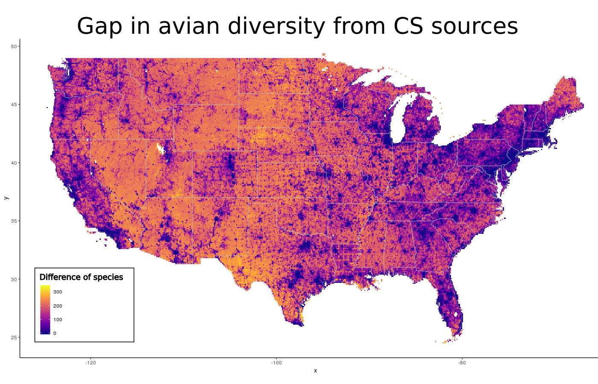
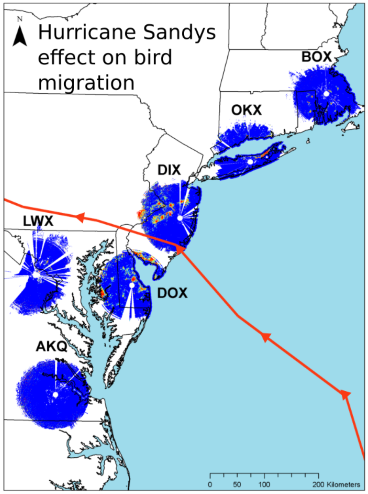
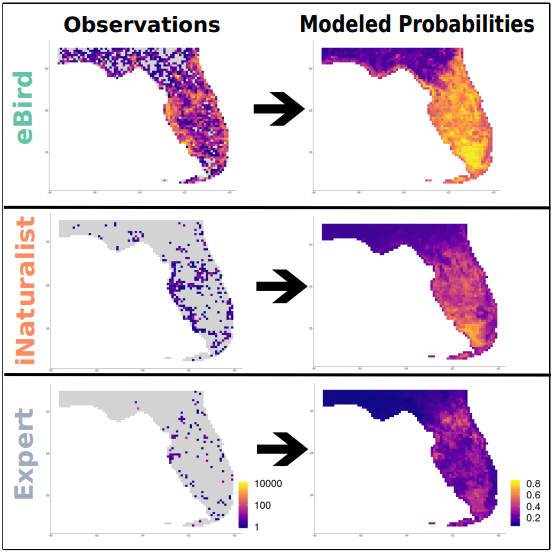
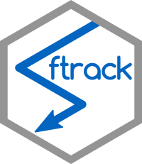
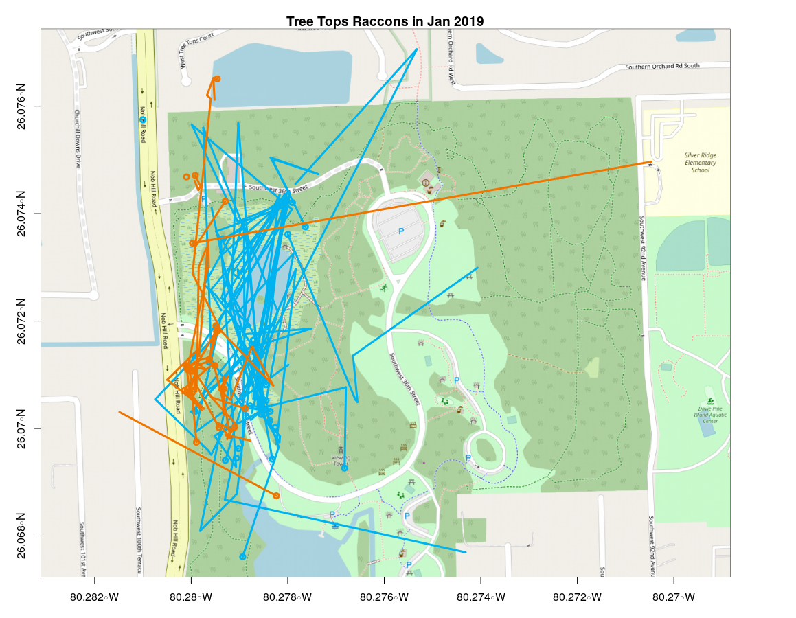
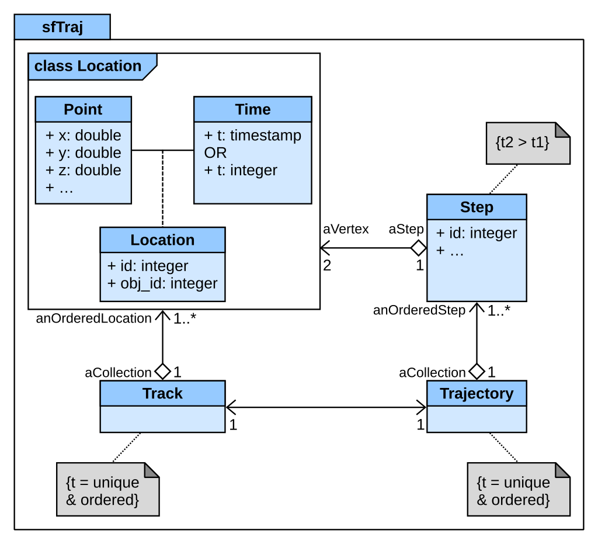
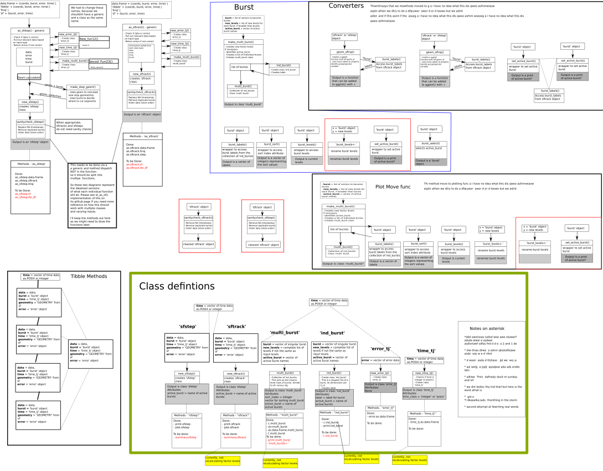
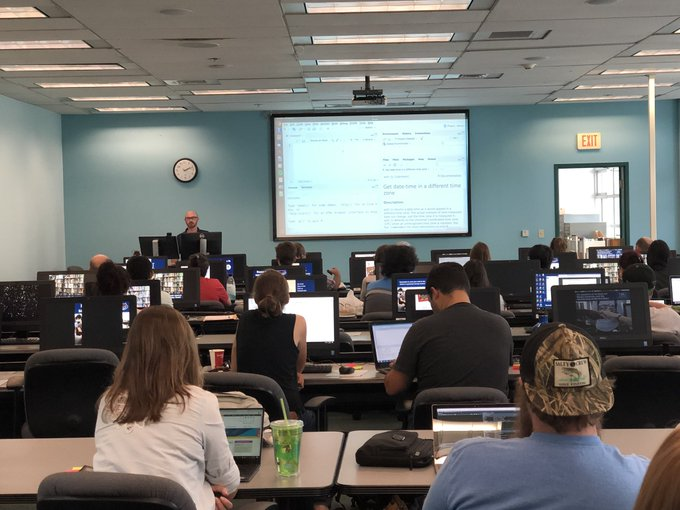

## Summary

- Brief History
- Citizen Science
- Spatial Applications
- Database management
- Software Development
- Teaching

--- 

## History

<table class="striped table" style="width:100%; font-size: 35px; margin-left: auto; margin-right: auto;">
 <thead>
  <tr>
   <th style="text-align:left;background-color: white !important;border-left:2px solid gray;border-right:2px solid gray;"> Time </th>
   <th style="text-align:left;background-color: white !important;border-left:2px solid gray;border-right:2px solid gray;"> Job </th>
  </tr>
 </thead>
<tbody>
  <tr>
   <td style="text-align:left;background-color: white !important;border-left:2px solid gray;border-right:2px solid gray;"> 2005 - 2009 </td>
   <td style="text-align:left;background-color: white !important;border-left:2px solid gray;border-right:2px solid gray;"> BSc Ecology, Evolution, Behavior - University of Texas </td>
  </tr>
  <tr>
   <td style="text-align:left;background-color: lightgray !important;border-left:2px solid gray;border-right:2px solid gray;"> 2009 - 2013 </td>
   <td style="text-align:left;background-color: lightgray !important;border-left:2px solid gray;border-right:2px solid gray;"> Field work (Oregon, Nevada, Hawaii, etc...) </td>
  </tr>
  <tr>
   <td style="text-align:left;background-color: white !important;border-left:2px solid gray;border-right:2px solid gray;"> 2014 - 2016 </td>
   <td style="text-align:left;background-color: white !important;border-left:2px solid gray;border-right:2px solid gray;"> MSc Wildlife Ecology - University of Delaware </td>
  </tr>
  <tr>
   <td style="text-align:left;background-color: lightgray !important;border-left:2px solid gray;border-right:2px solid gray;"> 2016 - 2017 </td>
   <td style="text-align:left;background-color: lightgray !important;border-left:2px solid gray;border-right:2px solid gray;"> DB Manager &amp; Analyst - Kauai Endangered Seabird Recovery Project (KESRP) </td>
  </tr>
  <tr>
   <td style="text-align:left;background-color: white !important;border-left:2px solid gray;border-right:2px solid gray;"> 2017 - 2019 </td>
   <td style="text-align:left;background-color: white !important;border-left:2px solid gray;border-right:2px solid gray;"> Independent Data Consultant - Porzana Data Solutions </td>
  </tr>
  <tr>
   <td style="text-align:left;background-color: lightgray !important;border-left:2px solid gray;border-right:2px solid gray;"> 2018 - 2020 </td>
   <td style="text-align:left;background-color: lightgray !important;border-left:2px solid gray;border-right:2px solid gray;"> DB Manager &amp; Biologist - University of Florida : Ft. Lauderdale Extension Center </td>
  </tr>
</tbody>
</table>

<!-- Want to mention the amount of agencies i've worked with --->

--- &vcenter bg:black

"I am a software developer trained as an ecologist who wants to build applications and software for biologists and the public. 

I want to help scientists collect data easier and make the science more accessible to the public."

---

## Working with Citizen Science

<ul>
<li>eBird reviewer for 8 years</li>
<li>iNaturalist</li>
<li>Lead bird walks</li>
<li>UF Broward County Bioblitz co-coordinator</li>
</ul>

---

## Working with Citizen Science - GBIF

<ul>
<li>Global Biodiversity Information Facility (GBIF)</li>
<li>Citizen Science (CS) and expert data sets can complement each other when used effectively.</li>
</ul>

<strong>Hochmair, H., Scheffrahn, R., Basille, M., Boone, M.</strong> <i>Evaluating the data quality of iNaturalist termite records.</i>  
<strong>PLoSONE</strong> (2020) 15.5: e0226534. <a href="https://doi.org/10.1371/journal.pone.0226534">10.1371/journal.pone.0226534</a> 

---

## Working with Citizen Science Data - Data Gaps

<ul>
<li>264M US avian records</li>
<li>PostGRES w/ PostGIS extension</li>
<li>10+ raster layers (environmental, geographic, topographic)</li>
</ul>

---

## Spatial Apps - nestR

<ul>
<li>Built in Shiny (r/html app tool)</li>
<li>Calculate nesting locations from GPS points</li>
<li>Spatially explore points with Leaflet</li>
<li>Available R package on github <a href=http:://github.com/picardis/nestR'>picardis/nestR</a></li>
</ul>

---

## Spatial Apps - eBird Filter apps
<!-- 
 -->

<!-- 
 -->

<ul>
<li>Built in Shiny (r/html app tool)</li>
<li>Help Tx eBird reviewers create accurate species filters for 254 counties</li>
<li>Identify problematic county filters</li>
<li>Explore species presence through time</li>
</ul>

<a href='https://birderboones.shinyapps.io/eBirdTX_filter/'><strong>Launch App</strong></a>

---

## Technology history

- Masters (2014 - 2016) : 
 - <b>Windows OS</b>
 - <b>mySQL</b> for eBird analysis
 - Radar analysis in <b>arcGIS</b> and <b>R</b>
 - Translated <b>SAS</b> code to R.
 
 

---

## Technology history

- Masters : 
- KESRP (2016 - 2017):
 - <b>Windows OS</b>
 - Field collection on <b>iPads</b> via <b>iForm</b>
 - Synced to an <b>AccessDB</b> via <b>VDB</b>
 - Lab GUI in <b>arcGIS</b>

--- 

## Technology history
<ul>
<li>Masters :</li>
<li>KESRP :</li>
<li>UF - Ft. Lauderdale Extension (2018 - 2020) : 
 <ul>
 <li><b>Linux (Ubuntu/Debian)</b></li>
 <li><b>postGRES</b>/<b>PostGIS</b> for data & raster layers</li>
 <li>Managed through <b>pgAdmin</b> and <b>R</b></li>
 <li>DBs connection to <b>QGIS</b></li>
 <li>Version history in <b>git</b> stored on Github & GitLab</li>
 <li><a href = "https://mablab.org/">Lab website</a>/presentations with <b>Html</b> & <b>CSS</b> using <b>Hugo</b>, <b>Jekyll</b>, & <b>Slidy</b> interfaces</b></li>
 <li>Documentation and manuscripts written in <b>Markdown</b> typeset language
  <ul>
  <li>Interactive <a href="https://rociojoo.github.io/mov-eco-review/">Bookdowns for Manuscripts</a></li>
  </ul>
 </ul>
</li> 
</ul> 

 

--- 

## Software Development

- radaR : 2016
- nestR : 2018
- refsplitR : 2019
- <b>sftrack</b> : 2020

--- 

## Software Development - Sftrack

- Unifying standard for movement data in R
- Continuous integration development
- Nightly Build framework
- Constant unit tests w/ <b>travis-ci</b>
- Transparent build process
- <a href="http://github.com/mablab/sftrack">github.com/mablab/sftrack</a>

--- &vcenter bg:url(assets/img/background2.png);background-size:contain;

## Sftrack : From concept to submission

### Planning meetings and original outlines

--- &vcenter bg:url(assets/img/background2.png);background-size:contain;

## Sftrack : From concept to submission

### ... to Beta stage

<!--
---

## Data Consulting & Teaching

--->

---

## Thank you!

You can view this presentation at : <a href = "http://birderboone.github.io/idfgSE">http://birderboone.github.io/idfgSE</a>
  
And find the assets at <a href="http://github.com/birderboone/idfgSE">http://github.com/birderboone/idfgSE</a>

